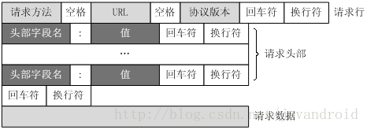
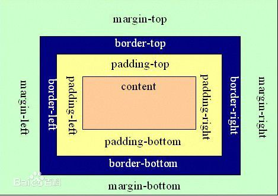

# http 常见状态码：

1\*\*(信息类)：表示接收到请求并且继续处理

2\*\*(响应成功)：表示动作被成功接收、理解和接受
200——表明该请求被成功地完成，所请求的资源发送回客户端
203——返回信息不确定或不完整

3\*\*(重定向类)：为了完成指定的动作，必须接受进一步处理
301——本网页被永久性转移到另一个 URL
302——请求的网页被转移到一个新的地址，但客户访问仍继续通过原始 URL 地址，重定向，新的 URL 会在 response 中的 Location 中返回，浏览器将会使用新的 URL 发出新的 Request。
304——自从上次请求后，请求的网页未修改过，服务器返回此响应时，不会返回网页内容，代表上次的文档已经被缓存了，还可以继续使用

4\*\*(客户端错误类)：请求包含错误语法或不能正确执行
400——客户端请求有语法错误，不能被服务器所理解
401——请求未经授权，这个状态代码必须和 WWW 一 Authenticate 报头域一起使用
HTTP 401.1 一 未授权：登录失败
403——禁止访问，服务器收到请求，但是拒绝提供服务
404——一个 404 错误表明可连接服务器，但服务器无法取得所请求的网页，请求资源不存在。eg：输入了错误的 URL

5\*\*(服务端错误类)：服务器不能正确执行一个正确的请求
HTTP 500 一 服务器遇到错误，无法完成请求
HTTP 502 一 网关错误
HTTP 503：由于超载或停机维护，服务器目前无法使用，一段时间后可能恢复正常

# 请求报文和响应报文都是由以下 4 部分组成

1.请求行

2.请求头

3.空行

4.消息主体

# Get 和 Post 的区别：

GET 请求的数据会附在 URL 之后，即数据直接显示在 url 中，以?分割 URL 和传输数据，参数之间以&相连

如：login.action?name=hyddd&password=idontknow&verify=%E4%BD%A0%E5 %A5%BD。

如果数据是英文字母/数字，原样发送，如果是空格，转换为+，如果是中文/其他字符，则直接把字符串用 BASE64 加密，得出如：%E4 %BD%A0%E5%A5%BD，其中%XX 中的 XX 为该符号以 16 进制表示的 ASCII。

而 POST 方法则会把数据放到请求数据字段中以&分隔各个字段，请求行不包含数据参数，地址栏也不会额外附带参数。

另外 GET 方法是没有报文体的

# 你对加班如何看待：

如果工作需要，我会义不容辞的加班，。但我也会提高工作效率，尽量减少不必要的加班

# 为什么想离职：

一般答这两方面的原因即可：一、薪资太少。二、没有成就感。我发现面试官对这两个答案很容易接受

# 介绍下自己：

首先我所有掌握知识都是自学而来，从开始看书看基础视频《JavaScript 高级程序设计》《head_first 设计模式》《ES6 入门》《angularjs 权威解读》《图解 HTTP》，浏览各种技术网站，GitHub，掘金，思否或者一些技术论坛，到现在会去研究一些别人源码实现，如何实现，解决了什么问题，是如何解决

# 盒模型

# CSS 重点

布局的传统解决方案，基于盒状模型，依赖 display 属性+ position 属性+ float 属性

明白什么是块级元素，什么是内联元素；块级元素（div, form，h1-h6,hr,p 等），内联元素（span,b,a,i,img）；

id 和 class 选择器的理解；

div 和 CSS 的配合（包括叠加，定位和浮动）；

布局，普通，自适应，响应式，流式等布局（一点点理解吧）；

# HTML 重点

标签，span,div 分清他们的特性，哪些是块级元素，哪些是行内元素;

语义化编程,HTML5 的新元素的运用;#

# 重点介绍爬虫项目

## 如何提高采集速度，性能优化

1.  多开 webview 并且采集完一条完整的数据就发回给服务器
    2， 对同种类型的链接进行拆分为子链接
    3。 多开采集端，每一个采集端可以接多个任务
    提高准确率
    主要是针对采集为空字段进行过滤
2.  优化启动加载，由于 angularjs 是没有懒加载的机制，懒即表示需要加载的资源不会在第一时间加载，而是在页面需要使用时再加载，通常用来提升首页加载效率。引入 oclazeload，在启动之前。app.config(routerCongig)在网上找的一个方案，另一个就是针对 electron 方面，在 electron 为准备好之前先在他的 ready-to-show 设置为 false

3.  针对易用性优化，主要是网上页面有很多千奇百怪的，需要不同的情况处理

4.  虚拟 dom 元素,递归优化，步骤流程树主布局，主要是针对删除一个节点的时候，由于节点下面存在多个子节点，我们直接在 compaire 阶段，得到删除内容 html，在 link 阶段直接一次性 link，而不需要递归的每个节点都去执行一遍 link，一个元素的 pre-link 函数能够保证是运行在它所有的子指令的 post-link 与 pre-link 运行之前执行的

浏览器：针对浏览器只能开启固定的并发线程去下载资源，可以采用 cdn 的方式，因为是不同的域名，所以不会存在这样的限制
http 链接：减少 http 链接，建立链接是非常耗时，http 是无状态 的协议，所以 css，js 都是需要压缩传输的，减少文件的大小
图片过多可以采用懒加载技术：当图片在不可见区域，不加载图片，判断 img 元素的 offsetTop 和 body。scrollHeight 是否超过了窗口的高度

# js 中数组增添、删除的方法

增添:push,unshift,concat
删除：splice,shift,pop

# 关于 angularjs

1. compaile
   NG 中是怎么样处理指令的

开始分析之前,先让我们看看 ng 中是怎么样处理指令的.

当浏览器渲染一个页面时,本质上是读 html 标识,然后建立 dom 节点,当 dom 树创建完毕之后广播一个事件给我们.

当你在页面中使用 script 标签加载 ng 应用程序代码时,ng 监听上面的 dom 完成事件,查找带有 ng-app 属性的元素.

当找到这样的元素之后,ng 开始处理 dom 以这个元素的起点,所以假如 ng-app 被添加到 html 元素上,则 ng 就会从 html 元素开始处理 dom.

从这个起点开始,ng 开始递归查找所有子元素里面,符合应用程序里定义好的指令规则.

ng 怎样处理指令其实是依赖于它定义时的对象属性的,你可以定义一个 compile 或者一个 link 函数,或者用 pre-link 和 post-link 函数来代替 link.

ng-repeat 就是一个最好的例子,它就在是 compile 函数阶段改变原始的 dom 生成多个原始 dom 节点,然后每个又生成 element 实例.因为 compile 只会运行一

次,所以当你需要生成多个 element 实例的时候是可以提高性能的.

git 工作流程
git 支持很多种工作流程，我们采用的一般是这样，远程创建一个主分支，本地每人创建功能分支，日常工作流程如下：

去自己的工作分支
\$ git checkout work

工作
....

提交工作分支的修改
\$ git commit -a

回到主分支
\$ git checkout master

获取远程最新的修改，此时不会产生冲突
\$ git pull 这一步可以让在你之前提交的合并

回到工作分支
\$ git checkout work

用 rebase 合并主干的修改，如果有冲突在此时解决
\$ git rebase master

回到主分支
\$ git checkout master

合并工作分支的修改，此时不会产生冲突。
\$ git merge work

提交到远程主干
\$ git push

这样做的好处是，远程主干上的历史永远是线性的。每个人在本地分支解决冲突，不会在主干上产生冲突。
